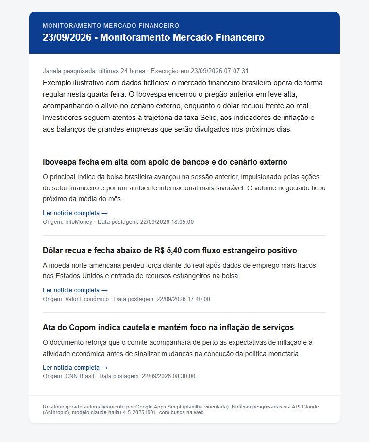

# agente_monitoramento_mercado_financeiro

Agente que **pesquisa diariamente notícias do mercado financeiro brasileiro** e envia
um **relatório em HTML por e-mail**. Roda inteiramente dentro do Google Workspace
(Google Apps Script vinculado a uma **planilha do Google Sheets**), usa a **API Claude
(Anthropic)** para pesquisar na web e resumir, e é publicado via **CLASP**.

> Versão simplificada de um projeto maior: **não** possui cadastro de termos
> prioritários nem log de execução em planilha. A priorização é feita pelo próprio
> modelo, por impacto no mercado.

---

## Exemplo do e-mail de notificação

É assim que o relatório chega na caixa de entrada dos destinatários definidos em
`EMAILS_NOTIFICACAO` (assunto: `DD/MM/AAAA - Monitoramento Mercado Financeiro`):



> Imagem ilustrativa, com **dados fictícios**, gerada com o próprio `EmailBuilder.gs`.
> O e-mail traz a janela pesquisada, o resumo geral do cenário e as notícias ordenadas
> por prioridade (título, descrição, link, origem e data). O rodapé identifica a API
> Claude e o modelo usado. Detalhes das variações (sem notícias e falha) na
> [seção 7](#7-modelo-de-e-mail).

---

## Sumário

1. [Visão geral](#1-visão-geral)
2. [Inteligência artificial: API Claude, modelo e busca na web](#2-inteligência-artificial-api-claude-modelo-e-busca-na-web)
3. [Ferramentas do Google utilizadas](#3-ferramentas-do-google-utilizadas)
4. [Arquitetura e estrutura do repositório](#4-arquitetura-e-estrutura-do-repositório)
5. [Configuração (aba `config` + API key)](#5-configuração-aba-config--api-key)
6. [Prompts (system e user)](#6-prompts-system-e-user)
7. [Modelo de e-mail](#7-modelo-de-e-mail)
8. [Deploy passo a passo (CLASP)](#8-deploy-passo-a-passo-clasp)
9. [Teste ponta a ponta](#9-teste-ponta-a-ponta)
10. [Operação e manutenção](#10-operação-e-manutenção)
11. [Custos, quotas e limites](#11-custos-quotas-e-limites)
12. [Solução de problemas](#12-solução-de-problemas)
13. [Segurança](#13-segurança)

---

## 1. Visão geral

Fluxo de uma execução (gatilho diário, ou manual pelo menu da planilha):

```
Gatilho diário (Apps Script, hora configurável — padrão 07h, America/Sao_Paulo)
        │
        ▼
Config.gs ── lê a aba "config" da planilha + API key nas Script Properties
        │
        ▼
PromptBuilder.gs ── lê prompt_system.txt / prompt_user.txt do Google Drive
        │           e substitui {{JANELA_HORAS}} e {{DATA_HORA_EXECUCAO}}
        ▼
ClaudeClient.gs ── POST https://api.anthropic.com/v1/messages
        │           (modelo Claude + tool web_search executada pela Anthropic)
        │           ◄── JSON { resumo_geral, noticias[] }
        ▼
EmailBuilder.gs ── ordena por prioridade, limita a N notícias, monta o HTML
        │
        ▼
Notifier.gs ── MailApp.sendEmail para os destinatários da aba "config"
```

Comportamentos importantes:

- **Sempre envia e-mail** ao terminar: relatório com notícias, aviso de "nenhuma
  notícia" ou e-mail de **falha** com a mensagem do erro e a etapa em que ocorreu.
  (Exceção: se a própria configuração estiver inválida não há destinatário
  confiável — o erro vai só para o log do Apps Script e para o alerta do menu.)
- **Janela de pesquisa**: últimas `JANELA_HORAS` horas (padrão 24) a partir do
  momento da execução.
- **Sem estado persistente**: não há log em planilha. O histórico técnico fica em
  *Extensões → Apps Script → Execuções* (logs `console.log`, mantidos pelo Google).

---

## 2. Inteligência artificial: API Claude, modelo e busca na web

### 2.1 Provedor e API

Este projeto usa a **API Claude da Anthropic** (não é o app claude.ai nem o Claude
Code) — mais especificamente a **Messages API**:

| Item | Valor |
|---|---|
| Endpoint | `POST https://api.anthropic.com/v1/messages` |
| Autenticação | cabeçalho `x-api-key` com a sua **API key** (criada no [Claude Console](https://console.anthropic.com/)) |
| Versão da API | cabeçalho `anthropic-version: 2023-06-01` (chave `ANTHROPIC_VERSION`) |
| Chamada HTTP | `UrlFetchApp.fetch` do Apps Script (`ClaudeClient.gs`) |
| Resposta | JSON estruturado, exigido pelo `prompt_system.txt` |

> É necessário ter **créditos/faturamento ativos** no Claude Console. A API é cobrada
> por uso, separadamente de qualquer assinatura do Claude.

### 2.2 Modelo utilizado

**`claude-haiku-4-5-20251001` (Claude Haiku 4.5)** — escolhido por ser o de menor
custo/latência da família com suporte à ferramenta de busca na web, suficiente para
pesquisar e resumir notícias. É o valor padrão da chave `ANTHROPIC_MODEL` na aba
`config`; para usar outro modelo (ex.: um Sonnet, mais caro e mais capaz) basta trocar
esse valor na planilha — sem redeploy. Confira os IDs vigentes na
[documentação de modelos da Anthropic](https://docs.anthropic.com/en/docs/about-claude/models).

### 2.3 Como é feita a consulta na web

A pesquisa **não** usa scraping, RSS nem outra API de notícias. Ela é feita pela
**ferramenta nativa `web_search` da API Claude** (*server tool*), declarada assim no
payload (`ClaudeClient.gs`):

```json
"tools": [{
  "type": "web_search_20250305",
  "name": "web_search",
  "max_uses": 5
}]
```

- **Executada do lado da Anthropic**: o modelo decide quais consultas fazer, a
  Anthropic executa as buscas e devolve os resultados ao modelo dentro da **mesma
  chamada HTTP**. O Apps Script **não** implementa loop de `tool_use`.
- **`max_uses`** (`WEB_SEARCH_MAX_USES`, padrão 5) limita quantas buscas o modelo pode
  fazer por execução — controla custo e tempo.
- O modelo é instruído (prompt system) a consultar os principais veículos
  brasileiros (G1, CNN Brasil, InfoMoney, Valor Econômico, Exame, Band, UOL, Estadão,
  Folha, Money Times, Investing.com Brasil etc.) e a **nunca inventar** notícias,
  links, datas ou fontes.
- A resposta pode ter vários blocos de texto (comentários antes das buscas); o código
  usa **apenas o último bloco**, que deve conter só o JSON, remove tags de citação
  `<cite>` inseridas pela API e extrai o trecho `{ ... }`.
- O código registra no log quantas buscas foram feitas e quantas falharam.

**Pré-requisito**: a busca na web precisa estar **habilitada na sua organização** no
Claude Console (configurações da organização). Se não estiver, a API retorna erro
(HTTP 400) na primeira execução — ver [Solução de problemas](#12-solução-de-problemas).

### 2.4 Formato de saída esperado do modelo

```json
{
  "resumo_geral": "parágrafo com o cenário geral do período",
  "noticias": [
    {
      "titulo": "...",
      "descricao": "parágrafo escrito pelo modelo",
      "link": "https://...",
      "origem": "InfoMoney",
      "data_postagem": "DD/MM/AAAA HH:mm:ss",
      "prioridade": 0
    }
  ]
}
```

`prioridade` (0–100) é usada para ordenar o e-mail (maior primeiro).

---

## 3. Ferramentas do Google utilizadas

| Ferramenta | Para quê | Onde no código |
|---|---|---|
| **Google Apps Script** (runtime V8) | Plataforma de execução: roda o código sem servidor, com gatilhos agendados | todo `src/` |
| **Google Sheets** (planilha vinculada) | "Hospedeira" do script (*container-bound*), aba `config` com parâmetros editáveis e menu **Monitoramento** | `Config.gs`, `Setup.gs`, `Menu.gs` |
| **Properties Service** (Script Properties) | Guarda o **segredo** `ANTHROPIC_API_KEY`, fora da planilha e do código | `Setup.gs`, `Config.gs` |
| **Google Drive** (`DriveApp`) | Armazena `prompt_system.txt` e `prompt_user.txt`, editáveis sem redeploy | `PromptBuilder.gs` |
| **UrlFetchApp** | Chamada HTTPS à API Claude | `ClaudeClient.gs` |
| **MailApp** | Envio do e-mail HTML (remetente = conta que instalou o gatilho) | `Notifier.gs` |
| **Triggers** (`ScriptApp`, time-driven) | Execução diária automática | `Triggers.gs` |
| **Utilities** | Formatação de datas no fuso `America/Sao_Paulo` | `Util.gs` |
| **Cloud Logging** (Stackdriver) | Logs `console.*` e erros, vistos em *Execuções* | `appsscript.json` |
| **Menu customizado** (`SpreadsheetApp.getUi`) | Menu **Monitoramento** com as ações de setup e teste | `Menu.gs` |

### 3.1 Por que Apps Script *vinculado à planilha* (e não standalone)?

- A **planilha é a interface de configuração**: e-mails, janela, modelo e limites são
  editados numa aba simples, sem mexer em código nem em Script Properties.
- O **menu** dentro da planilha permite instalar gatilho, gravar a API key e rodar um
  teste com poucos cliques.
- Um script *container-bound* acessa a planilha com `SpreadsheetApp.getActiveSpreadsheet()`,
  sem precisar guardar `SPREADSHEET_ID`.
- O deploy continua igual: código em `src/`, versionado no Git e enviado com `clasp push`.

### 3.2 Escopos OAuth (`src/appsscript.json`)

O Google pede autorização destes escopos na primeira execução:

| Escopo | Motivo |
|---|---|
| `spreadsheets` | Ler/criar a aba `config` |
| `drive.readonly` | Ler os arquivos de prompt no Drive |
| `script.container.ui` | Menu e diálogos na planilha |
| `script.external_request` | `UrlFetchApp` → API Claude |
| `script.send_mail` | `MailApp` → e-mail do relatório |
| `script.scriptapp` | Criar/remover o gatilho diário |

Manifesto também define `timeZone: America/Sao_Paulo`, `runtimeVersion: V8` e
`exceptionLogging: STACKDRIVER`.

### 3.3 Gatilho (trigger)

`instalarGatilhoDiario()` cria um gatilho **time-driven diário** com
`.atHour(HORA_EXECUCAO)`. O Apps Script dispara **em algum momento dentro da hora
escolhida** (ex.: entre 07:00 e 07:59), não exatamente no minuto zero. O gatilho é
executado como a conta que o instalou, e é essa conta que aparece como remetente do e-mail.

---

## 4. Arquitetura e estrutura do repositório

```
.
├── README.md                 esta documentação (única)
├── .gitignore                ignora .clasp.json / .clasprc.json
├── .claspignore              só envia *.gs e appsscript.json
├── assets/
│   └── email-exemplo.png     imagem do e-mail de exemplo (topo deste README)
├── prompts/
│   ├── prompt_system.txt     modelo do prompt de sistema (subir para o Drive)
│   └── prompt_user.txt       modelo do prompt de usuário (subir para o Drive)
└── src/                      rootDir do clasp
    ├── appsscript.json       manifesto (fuso, V8, escopos)
    ├── Util.gs               datas (fuso SP), helpers, escape HTML
    ├── Errors.gs             exceções tipadas por etapa
    ├── Config.gs             lê aba "config" + Script Properties -> cfg congelado
    ├── Setup.gs              prepararPlanilha(), salvarApiKey(), listarConfiguracao()
    ├── Menu.gs               onOpen() e ações do menu "Monitoramento"
    ├── Triggers.gs           instalar/remover/listar gatilho diário
    ├── Orchestrator.gs       monitorarMercadoFinanceiro() — fluxo completo
    ├── PromptBuilder.gs      lê prompts do Drive e substitui placeholders
    ├── ClaudeClient.gs       chama a API Claude (Messages API + web_search)
    ├── EmailBuilder.gs       MODELO do e-mail (sucesso / sem notícias / erro)
    └── Notifier.gs           envia via MailApp
```

Padrões adotados: módulos em IIFE (`const Modulo = (function(){...})()`), configuração
congelada (`Object.freeze`), erros tipados com `etapa` (`ConfigError`, `PromptError`,
`ClaudeApiError`, `EmailError`) e um único ponto de entrada global
(`monitorarMercadoFinanceiro`).

---

## 5. Configuração (aba `config` + API key)

### 5.1 Aba `config`

Criada pelo menu **Monitoramento → 1. Preparar planilha** (função `prepararPlanilha`,
idempotente: nunca sobrescreve o que você editou, só acrescenta chaves que faltam).
Colunas: `chave` · `valor` · `descricao`.

| Chave | Padrão | Descrição |
|---|---|---|
| `EMAILS_NOTIFICACAO` | `seu-email@exemplo.com` | Destinatários, separados por vírgula. **Obrigatório trocar** — a execução é bloqueada enquanto o e-mail modelo estiver presente |
| `JANELA_HORAS` | `24` | Janela de pesquisa, em horas |
| `MAX_NOTICIAS_RELATORIO` | `20` | Máximo de notícias no e-mail |
| `HORA_EXECUCAO` | `7` | Hora (0–23) do gatilho diário. Reinstale o gatilho após alterar |
| `ANTHROPIC_MODEL` | `claude-haiku-4-5-20251001` | Modelo Claude |
| `ANTHROPIC_VERSION` | `2023-06-01` | Cabeçalho `anthropic-version` |
| `ANTHROPIC_MAX_TOKENS` | `8192` | Limite de tokens de saída |
| `WEB_SEARCH_MAX_USES` | `5` | Máximo de buscas web por execução |
| `DRIVE_FILE_ID_PROMPT_SYSTEM` | *(vazio)* | ID do `prompt_system.txt` no Drive |
| `DRIVE_FILE_ID_PROMPT_USER` | *(vazio)* | ID do `prompt_user.txt` no Drive |

A coluna `valor` é formatada como **texto puro** para o Sheets não converter valores.
Alterações na aba valem já na próxima execução (exceto `HORA_EXECUCAO`, que exige
reinstalar o gatilho).

### 5.2 API key (Script Properties)

A única propriedade secreta é `ANTHROPIC_API_KEY`. Ela é gravada pelo menu
**Monitoramento → 2. Configurar API key da Anthropic** (caixa de diálogo) e fica
apenas nas **Script Properties** do projeto — nunca na planilha, no código ou no Git.

---

## 6. Prompts (system e user)

Os dois modelos estão em [`prompts/`](prompts/) e são lidos do **Google Drive** a cada
execução (então dá para ajustar tom, veículos e regras sem redeploy).

- **`prompt_system.txt`** — papel do modelo (assistente de pesquisa jornalística de
  mercado financeiro brasileiro), lista de veículos, regras obrigatórias (janela de
  tempo, não inventar dados, não copiar texto, sem tags de citação, sem duplicatas,
  **resposta final somente em JSON**), schema JSON e critério do campo `prioridade`.
- **`prompt_user.txt`** — pedido do dia, com dois placeholders substituídos pelo código:

  | Placeholder | Valor |
  |---|---|
  | `{{JANELA_HORAS}}` | `JANELA_HORAS` da aba `config` |
  | `{{DATA_HORA_EXECUCAO}}` | data/hora atual `dd/MM/yyyy HH:mm:ss` (fuso SP) |

> Se você mudar o schema JSON no `prompt_system.txt`, ajuste também o
> `EmailBuilder.gs` (e a validação em `ClaudeClient.gs`, que exige `noticias[]`).

---

## 7. Modelo de e-mail

`EmailBuilder.gs` traz **um modelo pronto e customizável** (HTML com tabelas e estilos
inline, compatível com clientes de e-mail). Existem três variações:

| Situação | Assunto |
|---|---|
| Sucesso (com ou sem notícias) | `DD/MM/AAAA - Monitoramento Mercado Financeiro` |
| Falha | `DD/MM/AAAA - Monitoramento Mercado Financeiro (Falha na Execução)` |

Conteúdo do e-mail de sucesso: janela pesquisada e horário, **resumo geral**, e a lista
de notícias (título, descrição, link "Ler notícia completa", origem e data). Sem
notícias: aviso + resumo do modelo. Falha: mensagem do erro com a etapa. O rodapé
informa que o relatório usa a API Claude e qual **modelo** foi usado.

Os **destinatários** vêm de `EMAILS_NOTIFICACAO` na aba `config`; o valor inicial
`seu-email@exemplo.com` é apenas um modelo e precisa ser substituído.

Para personalizar: edite as constantes de cor no topo do `EmailBuilder.gs`, o
`TITULO` e as funções `_render*`, depois `clasp push`.

---

## 8. Deploy passo a passo (CLASP)

### 8.0 Pré-requisitos

- Conta Google (Gmail ou Workspace) e uma **API key da Anthropic** com créditos.
- **Node.js** e o **CLASP** instalados (`npm install -g @google/clasp`). Comandos
  abaixo usam a sintaxe do clasp 3.x (`create-script`, `open-script`, `open-container`;
  `create` ainda funciona como apelido). Em instalação portátil, use o caminho
  completo do executável (ex.: `C:\Users\Renato\tools\node\clasp.cmd`).
- **Google Apps Script API ligada** para a sua conta em
  <https://script.google.com/home/usersettings> (obrigatório para o clasp).

### 8.1 Clonar o repositório

```powershell
git clone https://github.com/Renatoelho/agente_monitoramento_mercado_financeiro.git
cd agente_monitoramento_mercado_financeiro
```

### 8.2 Login no clasp

```powershell
clasp login
```

Abre o navegador para autorizar o clasp na sua conta Google. As credenciais ficam em
`~/.clasprc.json` (fora do repositório; também está no `.gitignore`).

### 8.3 Criar a planilha + script vinculado

**Opção A — automática (recomendada):** cria uma nova planilha no seu Drive já com o
projeto Apps Script vinculado e gera o `.clasp.json` local:

```powershell
clasp create-script --type sheets --title "Monitoramento Mercado Financeiro" --rootDir src
```

**Opção B — manual** (criar a planilha pelo navegador e pegar o ID do Apps Script):

1. **Criar a planilha do Google:** acesse <https://sheets.new> (ou
   <https://drive.google.com> → *Novo → Planilhas Google → Planilha em branco*),
   logado na conta que vai executar o agente. Dê um nome, ex.:
   `Monitoramento Mercado Financeiro`.
2. **Abrir o Apps Script vinculado:** na planilha, menu *Extensões → Apps Script*.
   Abre uma nova aba com o editor, já **vinculado** a essa planilha (o projeto é
   criado automaticamente na primeira vez, com um arquivo `Código.gs` de exemplo).
3. **Copiar o ID do script (Script ID):** no editor, clique no ícone de engrenagem
   **Configurações do projeto** (menu lateral esquerdo) → seção **IDs** → campo
   **ID do script** → botão *Copiar*. É um texto longo, algo como
   `1AbCdEfGh...xyz`.

   > **Atenção:** não confunda com o **ID da planilha** (trecho da URL da planilha
   > entre `/d/` e `/edit`). O clasp precisa do **ID do script**. Também é possível
   > achá-lo na URL do editor: `https://script.google.com/home/projects/`**`<ID_DO_SCRIPT>`**`/edit`.
4. **Criar o `.clasp.json`** na raiz do repositório com o ID copiado:

   ```json
   {
     "scriptId": "COLE_AQUI_O_ID_DO_SCRIPT",
     "rootDir": "src"
   }
   ```
5. Siga para `clasp push` (8.4). O `Código.gs` de exemplo do editor será substituído
   pelo conteúdo de `src/` (o push sobrescreve os arquivos remotos).

> `.clasp.json` contém o ID do seu projeto e está no `.gitignore`.

### 8.4 Enviar o código

```powershell
clasp push
```

Se o clasp avisar que o `appsscript.json` remoto difere do local, confirme
(`Y`) — o manifesto do repositório é o que vale (escopos, fuso, V8).
Para abrir o editor do script e a planilha:

```powershell
clasp open-script      # editor do Apps Script
clasp open-container   # a planilha vinculada
```

### 8.5 Subir os prompts para o Google Drive

1. No Drive, envie os arquivos `prompts/prompt_system.txt` e `prompts/prompt_user.txt`
   (arraste para uma pasta, mantendo texto puro `.txt`).
2. Para cada um: botão direito → *Compartilhar → Copiar link*. O **ID** é o trecho
   entre `/d/` e `/view`:
   `https://drive.google.com/file/d/`**`1AbC...xyz`**`/view`.
3. Guarde os dois IDs para o passo 8.7. (A conta dona da planilha precisa ter acesso
   de leitura aos arquivos — normalmente já tem, pois é quem os enviou.)

### 8.6 Configurar a planilha (menu Monitoramento)

Recarregue a planilha (F5). O menu **Monitoramento** aparece após alguns segundos.

1. **1. Preparar planilha (aba config)** — cria a aba `config` com as chaves padrão.
   Na **primeira vez**, o Google pede autorização dos escopos da seção 3.2 → *Revisar
   permissões* → escolher a conta → *Avançado → Ir para (projeto) → Permitir*
   (aviso de "app não verificado" é esperado: o script é seu).
2. **2. Configurar API key da Anthropic** — cole a chave `sk-ant-...`.

### 8.7 Preencher a aba `config`

Edite a coluna `valor`:

- `EMAILS_NOTIFICACAO` → seus destinatários reais (separados por vírgula);
- `DRIVE_FILE_ID_PROMPT_SYSTEM` e `DRIVE_FILE_ID_PROMPT_USER` → IDs do passo 8.5;
- demais chaves: conferir os padrões (modelo, janela, limites).

Use **Monitoramento → Validar configuração** para checar tudo de uma vez.

### 8.8 Instalar o gatilho diário

**Monitoramento → 3. Instalar gatilho diário.** Cria o gatilho para
`monitorarMercadoFinanceiro` na hora de `HORA_EXECUCAO`. Confira em
*Extensões → Apps Script → Acionadores* (ícone de relógio).

### 8.9 Atualizações futuras

| O que mudou | O que fazer |
|---|---|
| Código (`src/*.gs`) | editar → `clasp push` |
| Prompts | editar os arquivos no Drive (e atualizar `prompts/` no Git para manter o versionamento) |
| E-mails, janela, modelo, limites | editar a aba `config` |
| `HORA_EXECUCAO` | editar a aba `config` → menu *Instalar gatilho diário* de novo |

Para trazer alterações feitas direto no editor: `clasp pull`.

### 8.10 Referência rápida

```powershell
clasp login                 # autenticar
clasp create-script --type sheets --title "..." --rootDir src
clasp push                  # enviar código
clasp pull                  # trazer código do editor
clasp open-script           # abrir o editor do Apps Script
clasp open-container        # abrir a planilha
clasp status                # arquivos que serão enviados
```

---

## 9. Teste ponta a ponta

1. Certifique-se de que **Validar configuração** retorna sucesso.
2. **Monitoramento → Executar agora (teste)** — confirma o aviso (gera custo e envia
   e-mail) e aguarde 1–3 minutos.
3. **Esperado:**
   - alerta final `Concluído: N notícia(s), e-mail enviado.`;
   - e-mail nos destinatários com assunto `DD/MM/AAAA - Monitoramento Mercado Financeiro`;
   - em *Extensões → Apps Script → Execuções*, o log com as etapas `[INÍCIO]`,
     `[PROMPT]`, `[CLAUDE]` (HTTP 200, tokens, buscas feitas), `[noticias]`, `[EMAIL]`, `[FIM]`.
4. **Teste do caminho de erro** (opcional): grave uma API key inválida e rode de novo →
   deve chegar o e-mail `... (Falha na Execução)` com `HTTP 401`. Depois regrave a chave correta.

---

## 10. Operação e manutenção

- **Ver execuções/erros:** *Extensões → Apps Script → Execuções* (cada execução, com
  logs e duração). Falhas do gatilho também geram e-mail do próprio Google ao dono.
- **Pausar o agente:** menu *Remover gatilho diário*.
- **Trocar a API key:** menu *Configurar API key* (substitui a anterior).
- **Fins de semana/feriados:** o prompt orienta o modelo a trazer as notícias
  relevantes mais recentes e a explicar isso no resumo geral.
- **Funções auxiliares no editor:** `listarConfiguracao()` (API key mascarada) e
  `listarGatilhos()`.

---

## 11. Custos, quotas e limites

**API Claude (custo variável, por execução):**
tokens de entrada e saída do modelo (Haiku 4.5) **+** as buscas web (cobradas por
busca, até `WEB_SEARCH_MAX_USES` por execução) **+** os tokens dos resultados das
buscas que entram no contexto. Para reduzir custo: diminua `WEB_SEARCH_MAX_USES`,
`JANELA_HORAS` e `MAX_NOTICIAS_RELATORIO`. Consulte os valores atuais em
<https://www.anthropic.com/pricing> e acompanhe o consumo no Claude Console.

**Limites do Google Apps Script** (contas gratuitas; Workspace tem limites maiores —
ver [quotas oficiais](https://developers.google.com/apps-script/guides/services/quotas)):

- tempo máximo de uma execução: **6 minutos** (a chamada à API costuma levar 30 s–3 min);
- e-mails por dia via `MailApp`: **100** (Gmail) / **1.500** (Workspace) destinatários;
- tempo total de gatilhos por dia: **90 min** (Gmail) / **6 h** (Workspace);
- `UrlFetchApp`: tempo limite por requisição de cerca de 60 s no cliente HTTP do Apps
  Script — se a API demorar mais que isso pode ocorrer falha de rede; nesse caso
  reduza `WEB_SEARCH_MAX_USES`.

---

## 12. Solução de problemas

| Sintoma | Causa provável | Correção |
|---|---|---|
| Menu **Monitoramento** não aparece | planilha não recarregada / `clasp push` não feito | F5 na planilha; conferir `clasp push` |
| `Aba "config" não encontrada` | passo 1 do menu não executado | Menu → *Preparar planilha* |
| `ANTHROPIC_API_KEY não configurada` | passo 2 não executado | Menu → *Configurar API key* |
| `EMAILS_NOTIFICACAO ainda contém o e-mail modelo` | e-mail de exemplo não trocado | Editar a aba `config` |
| `Chaves sem valor na aba "config"` | IDs dos prompts vazios | Preencher `DRIVE_FILE_ID_*` |
| `PromptError` | ID errado, arquivo vazio ou sem permissão no Drive | Conferir IDs (passo 8.5) e acesso |
| `ClaudeApiError: HTTP 401` | API key inválida | Regravar a chave |
| `ClaudeApiError: HTTP 400` citando `web_search` | busca na web não habilitada na organização Anthropic | Habilitar no Claude Console |
| `ClaudeApiError: HTTP 429` | limite de taxa da API | Aguardar / reduzir `WEB_SEARCH_MAX_USES` |
| `ClaudeApiError: HTTP 529` / 5xx | sobrecarga temporária da API | Repetir a execução mais tarde |
| `Resposta truncada por limite de max_tokens` | `ANTHROPIC_MAX_TOKENS` baixo | Aumentar o valor ou reduzir `MAX_NOTICIAS_RELATORIO` |
| `Falha ao parsear JSON` | modelo devolveu texto fora do formato | Reforçar a regra 6 do `prompt_system.txt` e repetir |
| `Nenhuma notícia` com buscas com erro no log | falha nas buscas web | Ver linha `[CLAUDE] Buscas web` no log |
| E-mail não chega | escopo não autorizado, spam, quota | Reautorizar (rodar uma função no editor), checar spam e quota de e-mail |
| `clasp push` → API not enabled | Apps Script API desligada | Ligar em script.google.com/home/usersettings |
| `clasp create-script` recusa/duplica `appsscript.json` | já existe manifesto em `src/` | Use a Opção B (planilha manual + `.clasp.json`) |

---

## 13. Segurança

- A **API key** vive só nas Script Properties. Nunca a coloque na planilha, em
  código, em issues ou em commits. Se vazar, revogue no Claude Console e regrave.
- `.clasp.json` e `.clasprc.json` estão no `.gitignore` (contêm ID do projeto e
  tokens de login).
- O script roda com as **permissões da conta que o instalou**; compartilhe a
  planilha só com quem pode alterar a configuração (editores da planilha podem
  mudar destinatários e prompts, e usar o menu).
- O conteúdo dos prompts e das notícias é **escapado** antes de entrar no HTML do e-mail.
- O escopo do Drive é **somente leitura**.
